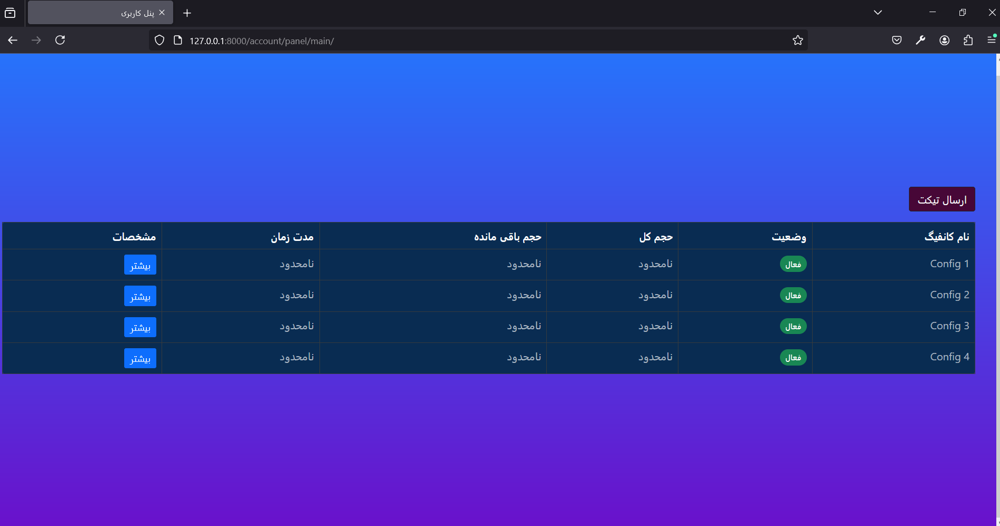
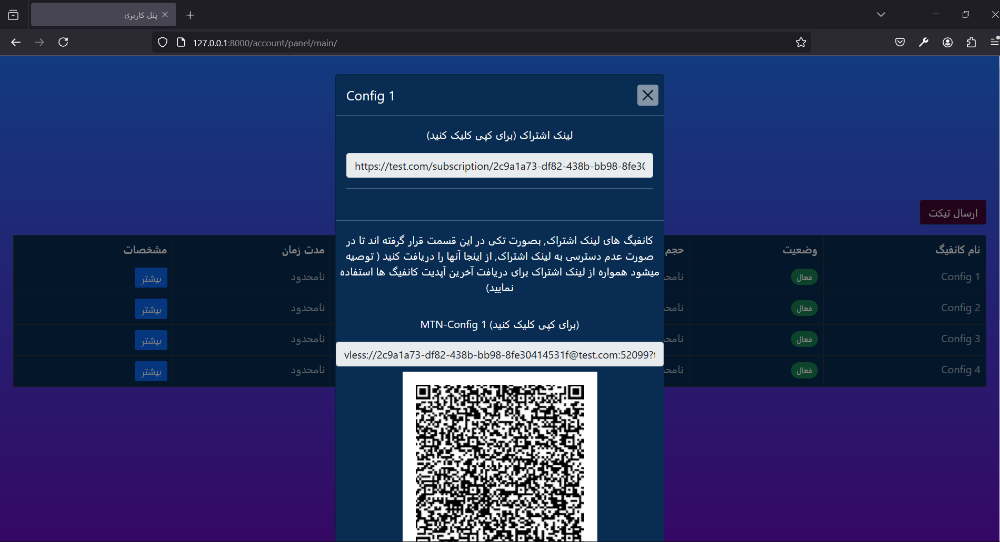
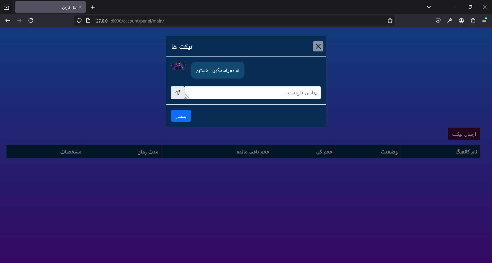

<h1>VPN Configuration Management Site</h1> 
<h3>This repository contains a two-layer web application designed for secure VPN configuration management. The site features:</h2> 

<ol>
    <li>
        <h3>Portfolio Interface (Public View):</h3>
        
A simple and clean portfolio-style main page that serves as the public-facing interface of the site.

    </li>
    <li>
        <h3>VPN Configuration Dashboard (Private Path):</h3>
        
A private dashboard accessible to authenticated users, where they can view and manage their VPN configuration settings.

    </li>
</ol>

<h3>Key Features:</h3>
<ul>
<li>Public-facing portfolio for anonymity and user deception</li>
<li>Secure authentication to access private VPN configurations.</li>
<li>Flexible routing for user login and control panel access.</li>
<li>Lightweight, efficient design for easy deployment.</li>
</ul>

<h3>Technologies Used</h3>
<ul>
<li>Frontend: Bootstrap</li>
<li>Backend: Django</li>
<li>Database: Sqlite</li>
</ul>

<h1>Usage: </h1>
<ol>
<li>run: <code>git clone https://github.com/MmdUnion/v2ray_django.git && cd v2ray_django</code></li>
<li>in v2_django/settings.py edit:</li>
    - line 24: generate your secret key, you can use some sites like: 
    <a href="https://django-secret-key-generator.netlify.app">Django secret key generator</a> 
    - line 27: set the debug to false (if you want use it on production) 
    - line 30: set your domain (django served this domain) 
    - line 33: set your user login path 
    - line 36: set your admin login path 
    - line 39: set your telegram bot token (if you want receive login notification) 
    - line 42: set your telegram admin id (get it from @userinfobot from telegram) 
    - line 45: set your panel cookies, you can capture the panel cookies in the network tool of browser (currently only <a href="https://github.com/MHSanaei/3x-ui">3xUI</a> panel supported) 
    - line 48: set your panel domain/ip  

<li>run: <code>pip install -r requirements.txt</code></li>
<li>run: <code>python3 manage.py migrate</code></li>
<li>run: <code>python3 manage.py createsuperuser</code></li>
<li>run: <code>python3 manage.py runserver</code></li>
<li>Finally: login to your admin panel, then create user and point the user to config id in the 3xui panel, then if user login with its credentials he/she can see its existing configs</li>
</ol>
 

     
     
     

